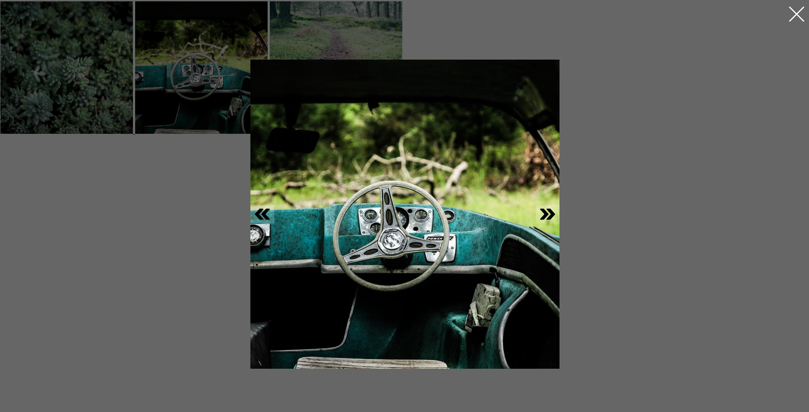

# Vanilla Lightbox

## Introduction

##### Lightbox is small javascript library used to overlay images on top of the current page. It's a snap to setup and works on all modern browsers.

##### Supports all major browsers (Google Chrome, Firefox, Safari, IE 11, Edge)

## Installation

#### Install package:
##### `npm i vanilla-lightbox`
#### Import package into your JS file as ES6 module:
##### `import VanillaLightbox from 'vanilla-lightbox'`

#### Use Vanilla lightbox:
##### `const vanillaLightbox = new VanillaLightbox`
#### Use Vanilla lightbox styles (scss):
##### `@import "~vanilla-lightbox/src/scss/app.scss";`

#### Now support:

 - Single Image lightbox
 - Gallery lightbox
 - Iframe lightbox

#### Images are loaded with lazyload on click

```
<!-- Gallery -->
<div class="lightbox" style="width: 100%">
    <a href="https://picsum.photos/600">
        
    </a>
    <a href="https://picsum.photos/700">
        
    </a>
    <a href="https://picsum.photos/800" class="lazy">
        
    </a>
</div>

<!-- Single -->
<div class="lightbox" style="width: 100%">
    <a href="https://picsum.photos/600" class="lazy">
        
    </a>
</div>

<!-- Iframe -->
<div class="lightbox iframe" style="width: 100%">
    <a href="https://www.youtube.com/embed/2MpUj-Aua48">
        
    </a>
</div>
```


